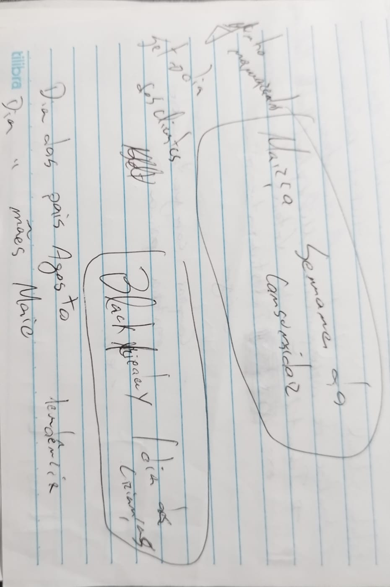
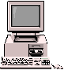
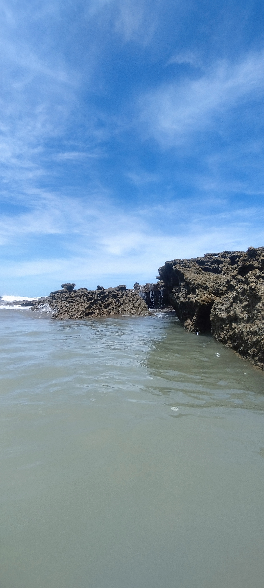

# Reconhecimento Facial e transformação de imagens em Dados no Azure ML

Simulações com imagnes e textos utilizando técnicas OCR, Spatial analysis, face recognition and Extract common tags from images

## analyses

* 1: OCR

Foto de rascunho que o método fez o melhor possívelpra capturar os textos que estavam completamente bagunçados na imagem

 

* resultado:

Marzia
Semana99
ConsumidaR
2019
1
get
febclientes
BlackLienary
DiadaspaísAgosto
Crianças)
1
tilibraDia"
maresMaio
Temgente
11

* 2: tags

imagem tipo ícone de um PC 

* resultado:

text (98.83%)
computer (93.17%)
output device (92.85%)
display device (90.93%)
indoor (89.67%)
computer monitor (88.50%)
flat panel display (88.07%)
screen (87.10%)
television (85.98%)
electronic device (85.44%)
led-backlit lcd display (84.93%)
office supplies (84.80%)
office equipment (84.21%)
television set (84.02%)

* 3: dense captions to images

paisagem

"

* resultado:

A rocky shore with water flowing over it
A blue sky with clouds above a rocky cliff
A rock formation with water falling
A river with rocks in it
A blue sky with clouds and a rocky hill
A waterfall over rocks
A waterfall over rocks in water
A close up of a cloud
A body of water with rocks and rocks
A white circle on a gray surface

* comentários:
Além das aplicações evidentes de reconhecimento facial, aplicações para maior acessibilidade e inclusão, me impressionou muito a capacidade de reconhecimento do rascunho. A escrita de mão livre ser reconhecida e organizado em código pode ter aplicações anti-fraude, pesquisa de documentos antigos, ou simplesmente organização de anotações pessoais